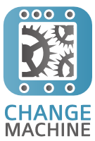

ChangeMachine
=========================================

ChangeMachine was written to handle the CouchDB change processing required in `Steelmesh`_.  It is responsible for monitoring and responding to changes in a number of couchdb instances and taking appropriate actions in response to those changes.

The implementation of ChangeMachine is reasonably simple thanks to the `flatiron neuron`_ queueing library and through leveraging `changemate`_ notifiers. 

Contents
--------

.. toctree::
	:maxdepth: 2
	
	getting-started
	usecases
	examples

Indices and tables
------------------

* :ref:`genindex`
* :ref:`modindex`
* :ref:`search`

.. include:: links.txt

